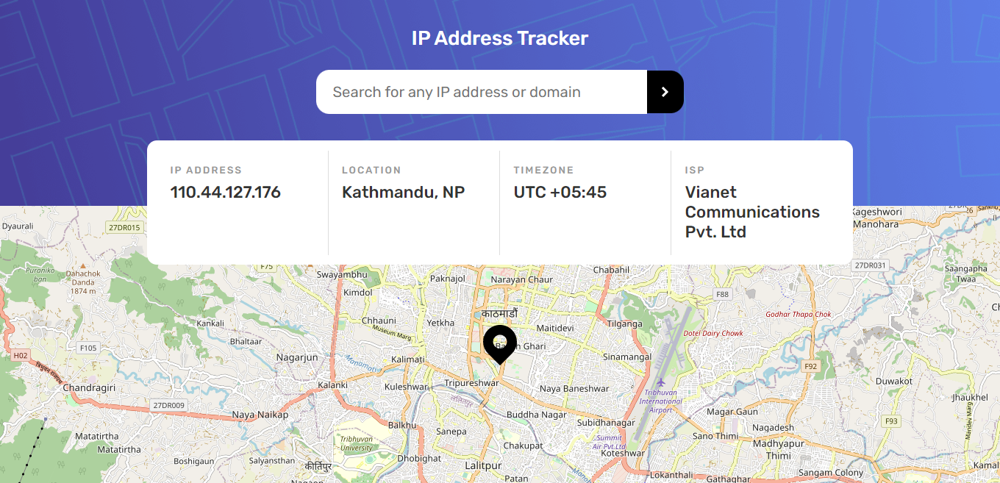

# Frontend Mentor - IP address tracker solution

This is a solution to the [IP address tracker challenge on Frontend Mentor](https://www.frontendmentor.io/challenges/ip-address-tracker-I8-0yYAH0). Frontend Mentor challenges help you improve your coding skills by building realistic projects.

## Overview

### The challenge

Users should be able to:

- View the optimal layout for each page depending on their device's screen size
- See hover states for all interactive elements on the page
- See their own IP address on the map on the initial page load
- Search for any IP addresses or domains and see the key information and location

### Screenshot

### Links

- Solution URL: [Add solution URL here](https://your-solution-url.com)
- Live Site URL: [https://fm-ipaddress-tracker.netlify.app](https://fm-ipaddress-tracker.netlify.app)

## My process

### Built with

- Semantic HTML5 markup
- Flexbox
- Vanilla JavaScript
- Mobile-first workflow
- [Leaflet](https://leafletjs.com) - JS library
- [IP Geolocation API](https://geo.ipify.org)
